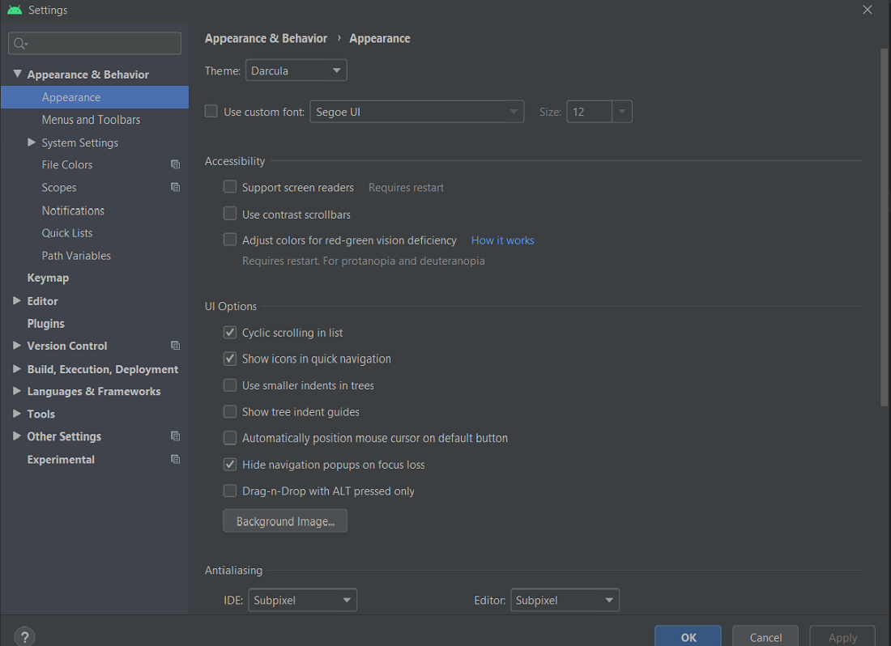
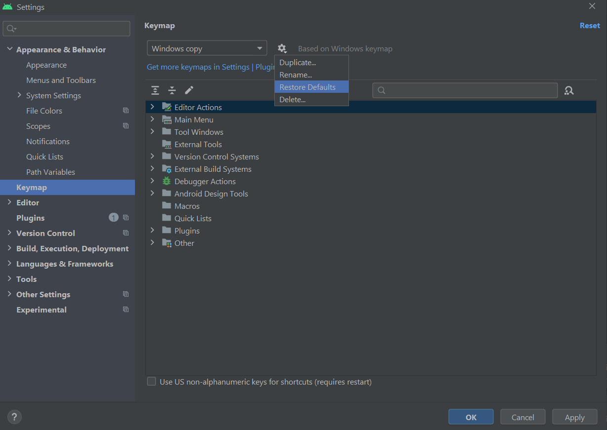

# ⚙️ Android Studio Settings Export – Ankit Parmar

A portable `.jar` containing your customized Android Studio settings. Easily restore your development environment on **Windows or macOS**.

---

## ✨ Included in this Settings File

- 🎨 Editor Theme
- 🧑‍💻 Keymaps
- 💡 Code Styles (Java, Kotlin)
- 🛠️ Plugin Preferences
- ⚙️ IDE UI Settings

---

## 📸 Screenshots

| Editor Theme                          | Keymap Setup                          |
|--------------------------------------|---------------------------------------|
|  |  |

---

## 🧭 How to Import

### 🪟 On Windows / 🍎 On macOS

#### 💼 If Android Studio is **not open yet**

1. Launch Android Studio.
2. On the Welcome screen → click `Import Settings`.
3. Choose `android_studio_settings.jar`.
4. Restart Android Studio.

#### 🔄 If Android Studio is already open

1. Go to:  
   `File > Manage IDE Settings > Import Settings`
2. Select `android_studio_settings.jar`.
3. Check items you want to import (themes, keymaps, etc).
4. Click OK → Restart IDE.

---

## 📂 File Info

| Key Detail       | Value                               |
|------------------|--------------------------------------|
| Exported By      | **Ankit Parmar**                     |
| File Name        | `android_studio_settings.jar`        |
| Exported From    | Android Studio `Giraffe / Hedgehog` |
| Created On       | `01 June 2025`                       |
| Compatible OS    | Windows & macOS                      |

---

## 📧 Contact

**Ankit Parmar**  
📩 [codewithankit056@gmail.com](mailto:codewithankit056@gmail.com)  
🔗 [GitHub: @theankitparmar](https://github.com/theankitparmar)

---

## 🛡️ License

This settings export is shared under the **MIT License**.  
Free to use, modify, and redistribute.

